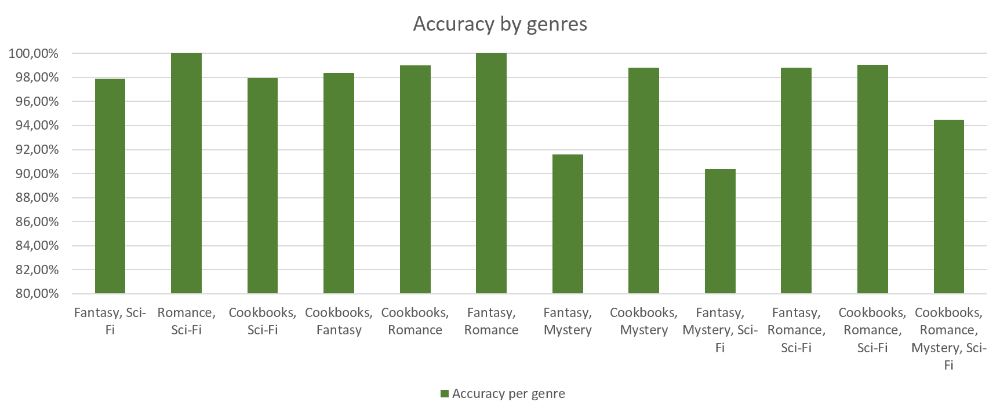

A java application that detects a book's genre based on its text.

## Test data

1050 books in 5 genres:
- cookbooks
- fantasy
- mystery
- romance
- science fiction

A total of 2.34GiB in EPUB files.

## Classification accuracy

The classification accuracy of the above test data is 93% for all books and genres.
The accuracy for 4 genres (all of the above except mystery) is **98%**.
The percentage is a result of 10-fold cross-validation.

## Performance

The application uses threads and the new Java 8 concurrency APIs for increased parallel performance.

